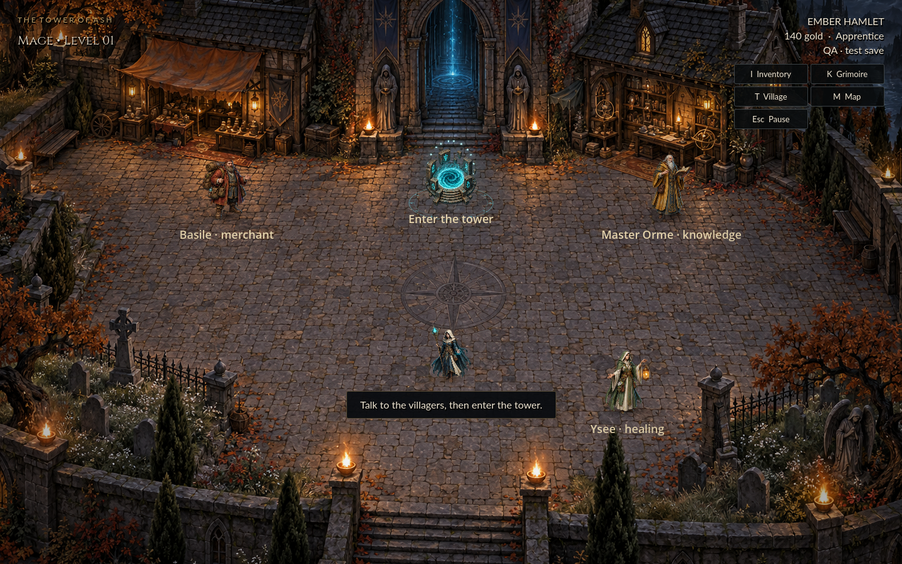
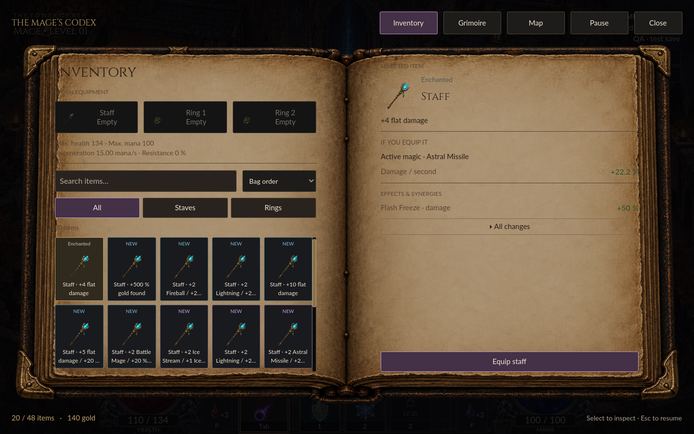

# The Tower of Ash

**One exam. Thirteen floors. Four elements to master.**

A single-player, top-down action RPG for macOS and Windows, built with Godot 4.7.2. Start as an apprentice in Ember Hamlet, shape your spell build, and climb a procedural tower to face the Ash Archivist.

Inspired by the mechanics of **Solomon’s Keep**, with original code, generated artwork, and synthesized audio. An independent project, not affiliated with Raptisoft.



## Play from source

1. Install **Godot 4.7.2 stable** with the standard GDScript editor.
2. Clone this repository and import `project.godot`.
3. Press **F5** to launch the game.

```sh
git clone https://github.com/DwennK/Solomon-Castle.git
cd Solomon-Castle
# With Godot available on PATH, or GODOT_BIN set to its executable:
./tools/godot.sh --path .
```

No account, server, plugin, or asset-generation step is needed. All runtime art and audio are included. The game uses Godot’s Compatibility renderer and opens maximized; fullscreen is available in settings.

**Language:** English throughout the game. Older French saves remain usable, including translated item names and checkpoint labels.

## Build your ascent

- **Four primary spells:** Astral Missile, Fireball, Lightning, and Ice Stream. Aim freely, manage mana, and build around projectiles or continuous attacks.
- **Six elemental fusions:** combine two learned elements into a new spell. Fusion offers can appear every five levels; their ranks and subskills are captured when learned. Learning a fusion again updates that snapshot.
- **Seven rituals and 24 passives/specializations:** equip two rituals, with a third slot at level 20. Choose an upgrade at each level and spend Knowledge Shards to reroll eligible choices.
- **Equipment with tradeoffs:** one staff, two rings, and a 48-item bag. Search and sort loot, compare effective stats after caps, and inspect how items affect your current spells.
- **Thirteen procedural floors:** explore rooms and corridors, find guardian keys, defeat bosses on floors 4, 8, 11, and 13, then finish the summit encounter.
- **Five difficulties:** Apprentice, Sorcerer, Archmage, Demigod, and the Eternal Trial. A completed ascent unlocks the next difficulty while retaining your skills and gear.

In the village, **Basile** buys and sells equipment and potions, **Orme** teaches magic and sells lessons, and **Ysee** restores health and mana for free. Your portal lets you return to the village and resume exploring the same floor.

**Normal death** restores the last floor-entry or portal checkpoint and undoes later actions. **Hardcore death** permanently ends that campaign. The Eternal Trial always uses hardcore rules.



Equipment no longer grants XP bonuses. Loading a save removes these bonuses from existing items, merchant stock, ground loot, and checkpoints. Items with no remaining bonus are removed and their equipped slots cleared; other bonuses and earned progression are preserved. The updated catalogue contains 92 recipes (55 staves and 37 rings).

## Controls

| Action | Keyboard / mouse | Controller |
|---|---|---|
| Move | WASD, ZQSD, or arrows | Left stick |
| Aim and fire | Mouse + hold left click; Space also fires | Right stick |
| Interact | E | A |
| Switch magic | Tab | B |
| Rituals 1 / 2 / 3 | 1 / 2 / 3 | LB / RB / X |
| Health / mana potion | R / F | D-pad left / right |
| Village portal | T | D-pad down |
| Inventory | I | Y |
| Grimoire | K | Back / Select |
| Map | M | D-pad up |
| Pause | Esc | Start |

Navigate menus with the mouse, arrows/Tab + Enter, or a controller’s D-pad/stick and A/B. Keyboard actions and controller buttons can be rebound in **Options & controls**. Settings also include master, music, and effects volume, brightness, fullscreen, and reduced flashes.

## Saves and compatibility

The English title keeps the original save directory so existing campaigns and settings are found automatically:

| Platform | Save directory |
|---|---|
| macOS | `~/Library/Application Support/Godot/app_userdata/La Tour des Cendres/` |
| Windows | `%APPDATA%\Godot\app_userdata\La Tour des Cendres\` |

`campaign.json` contains a versioned campaign with an integrity checksum; `campaign.json.bak` is the backup. Writes use a temporary file followed by a rename. The game saves every 15 seconds, at transitions, and on a normal close. You can also save from the pause menu.

If the main save is damaged, the game attempts to restore its valid backup. Settings and unlocked difficulties are stored separately. Starting a new game replaces the current campaign but preserves those settings and unlocks.

Close the game before copying or moving saves. Files named `qa_*.json` belong to developer tests and are never loaded as player campaigns.

## Develop and test

```text
scenes/       Main, world, player, and enemy scenes
scripts/      Gameplay, UI, procedural generation, audio, and saves
resources/    Editable spell, enemy, item, and progression definitions
assets/       Runtime artwork, fonts, and audio
tests/        Headless regression suites and native UI checks
tools/        Engine launcher, content generators, export, and packaging
docs/         Architecture, reference analysis, asset provenance, and QA notes
```

Run commands from the repository root. On macOS/Linux, `tools/godot.sh` uses `GODOT_BIN`, a `godot` executable on PATH, or the documented local tools installation. On Windows, replace the launcher with the path to the Godot executable.

```sh
# Import resources and check scripts.
./tools/godot.sh --headless --path . --editor --import --quit

# Gameplay, equipment, skills, and English-save compatibility.
mkdir -p outputs/skills-audit
./tools/godot.sh --headless --path . tests/tests.tscn -- --test
./tools/godot.sh --headless --path . tests/equipment_test.tscn -- --test
./tools/godot.sh --headless --path . tests/skills_test.tscn -- --test
./tools/godot.sh --headless --path . tests/english_test.tscn -- --test

# Native renderer, real UI input, and multiple desktop resolutions.
./tools/godot.sh --path . tests/codex_ui.tscn -- --qa

# Assisted full-campaign regression.
./tools/godot.sh --headless --path . -- --qa --qa-playthrough
```

The core suite covers 100 seeds × 13 floors, reachable exits, combat, purchases, equipment, save corruption, death, and progression. The accelerated campaign deliberately grants strong skills and invulnerability while using the real movement, combat, doors, and bosses; it is an assisted regression, not an unaided playthrough. QA saves are isolated from player saves. Do not run two tests that use the same QA save concurrently.

Definitions in `resources/**/*.tres` can be edited in Godot’s Inspector. `tools/create_content.py` regenerates them and **overwrites manual changes**; keep the generator and `tools/skill_catalog.py` aligned. English text is authored in scripts and resource definitions. Regenerate the source-language catalogue with `python3 tools/extract_translations.py` after editing text.

## Export desktop builds

Install Godot’s official **4.7.2.stable export templates**, then run:

```sh
./tools/export.sh
python3 tools/package.py
```

| Output | Target |
|---|---|
| `outputs/La-Tour-des-Cendres-macOS.zip` | Universal macOS app, Apple Silicon and Intel |
| `outputs/La-Tour-des-Cendres-Windows.zip` | Windows x86-64 executable |
| `outputs/La-Tour-des-Cendres-Sources.zip` | Source archive with notices, without development caches |

Archive filenames retain their historical names for script compatibility. Fresh macOS exports use **The Tower of Ash.app**; Windows uses `La-Tour-des-Cendres.exe`. Build artifacts are generated locally and are not committed to this repository. Pulling source updates does not update an older exported application.

**Platform limits:** native rendering and interactions are checked on macOS. Windows exports require testing on Windows; an export alone is not a runtime test. Physical controllers have not been verified. macOS builds use ad-hoc signing without Apple notarization, and Windows builds are unsigned.

## Credits and project notes

Original GDScript implementation, ImageGen-generated illustrations, and synthesized music and sound effects. No code, characters, sounds, or graphics from Solomon’s Keep are reused. Godot is distributed under the MIT license; font and engine notices are included with the project and packaged builds.

- [Asset provenance and license notices](docs/asset_manifest.md)
- [Architecture](docs/architecture.md)
- [Reference mechanics and deliberate differences](docs/reference_analysis.md)
- [Skill audit](docs/skills_audit.md)
- [Environment art](docs/environment-v5.md)
- [QA methodology and historical evidence](docs/qa_report.md)

Some historical development notes remain in French and describe earlier builds. Character motion uses procedurally animated painted silhouettes. Combat coefficients and progression are this project’s own adaptation; long human playthroughs remain useful for balancing.
